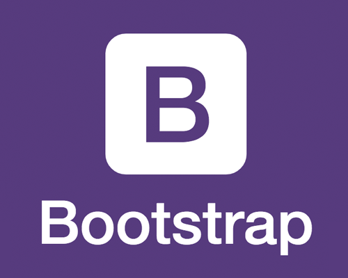

<h2>Hi there. 🖐🌍 I'm Talha</h2>

- 🚀 I'm a full stack developer, interested in everything but my speciality is mobile applications. 
- 💪 I’m currently working on frontend and mobile app development (JavaScript | React | React Native | HTML | CSS)
- ✍ Currently, I am trying to improve myself backend development (Node.js | Express | MongoDB | Django)
- ❓   Ask me about anything that you want to learn
- 💥 I like walking🏃‍ and traveling✈. I'm also learning to play the guitar.🎻
 
 

  
  
    

<!-- -->
 
 

### Connect with me:

### My Tools :

<!--✨--> 
<!--✨--> 
<!--✨--> 
<!--✨--> 
<!--✨--> 
<!--✨-->
<!--✨--> 
<!--✨--> 
<!--✨--> 
<!--✨--> 
<!--✨--> 
<!--✨--> 
<!--✨--> 
<!--✨--> 
<!--✨--> 
<!--✨--> 
<!--✨--> 
<!--✨--> 
<!--✨--> 
<!--✨--> 
<!--✨-->
<!--✨-->
<!--✨-->
<!--✨-->
<!--✨-->

<h2> Happy Coding! 😊</h2>

<!--
**serdardurmus/serdardurmus** is a ✨ _special_ ✨ repository because its `README.md` (this file) appears on your GitHub profile.

Here are some ideas to get you started:

- 🔭 I’m currently working on ...
- 🌱 I’m currently learning ...
- 👯 I’m looking to collaborate on ...
- 🤔 I’m looking for help with ...
- 💬 Ask me about ...
- 📫 How to reach me: ...
- 😄 Pronouns: ...
- ⚡ Fun fact: ...
-->
